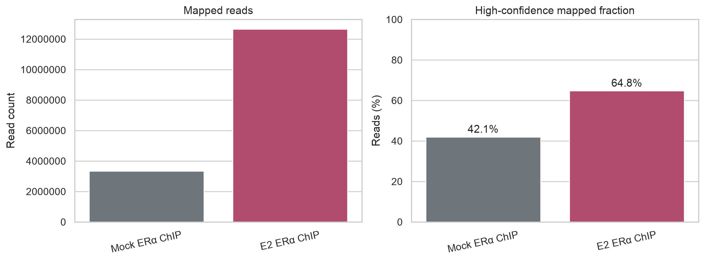
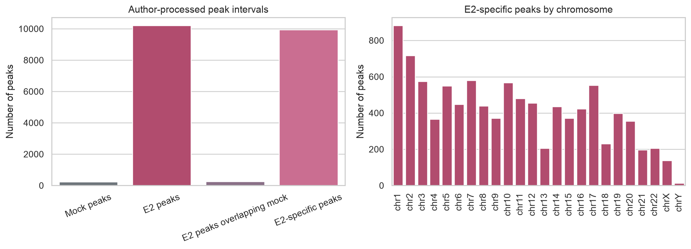
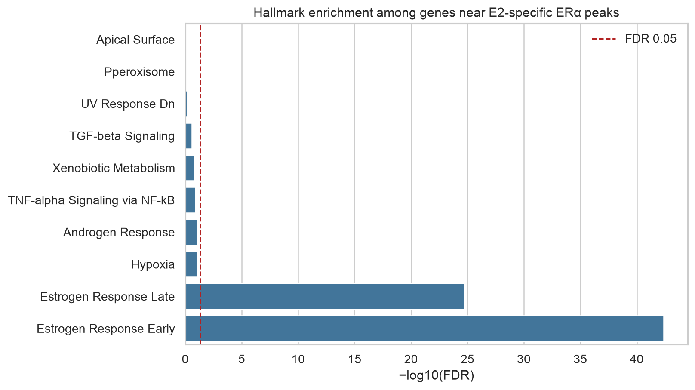

# Estrogen receptor ChIP-seq in MCF-7 cells

[](https://github.com/verswijveldavid-ops/eralpha-chipseq-mcf7/actions/workflows/validate.yml)

A complete ChIP-seq analysis of estrogen receptor alpha (ERα) occupancy after
estradiol stimulation using public
[GSE14664](https://www.ncbi.nlm.nih.gov/geo/query/acc.cgi?acc=GSE14664) data.
The repository combines a documented FASTQ-to-peaks pipeline with reproducible
analysis of the author-deposited peak intervals, motif results, nearest-gene
assignments and functional enrichment.

## Results in brief

- Mock ERα ChIP: 3.33 million mapped reads; 1.40 million at MAPQ ≥30
- E2 ERα ChIP: 12.65 million mapped reads; 8.20 million at MAPQ ≥30
- MACS3 E2-versus-mock regions: 4,448
- Author-processed peaks: 10,205 E2 and 240 mock intervals
- E2-specific intervals: 9,948 (97.5% of E2 intervals)
- E2-specific peaks assigned within 50 kb of a TSS: 7,016
- Strongest motifs: ER/estrogen-response elements
- Significant Hallmark pathways: Estrogen Response Early and Late







## Biological interpretation

Estradiol treatment is associated with a large expansion of ERα peak
intervals. Estrogen-response elements are the strongest motif family, while
genes near E2-specific peaks are strongly enriched for early and late estrogen
response. These independent motif- and gene-level results form a coherent
biological validation of the E2/ERα signal.

The experiment has one library per condition and no matched input chromatin.
The peak overlap is therefore a descriptive condition-specific comparison,
not a replicate-based statistical differential-binding test.

## What the project demonstrates

- A documented FASTQ-to-peaks workflow using SRA Toolkit, FastQC, Bowtie2,
  samtools, MACS3 and deepTools
- Coordinate-aware peak processing on the matching hg18 reference build
- Peak overlap, nearest-gene assignment and genomic annotation
- Motif analysis with HOMER and Hallmark pathway enrichment
- Reproducible data provenance, checksum verification and automated validation
- Careful separation of descriptive results from replicate-based inference

## Reports

- [`notebooks/01_eralpha_chipseq_analysis.ipynb`](notebooks/01_eralpha_chipseq_analysis.ipynb)
  — complete executed analysis
- [`reports/01_eralpha_chipseq_analysis.html`](reports/01_eralpha_chipseq_analysis.html)
  — standalone HTML report with embedded figures
- [`pipeline/run_chipseq.sh`](pipeline/run_chipseq.sh) — storage-conscious
  FASTQ-to-peaks workflow for a server with the required tools and hg18 index

## Repository structure

```text
.
├── notebooks/            # complete executed Jupyter analysis
├── reports/              # standalone HTML report
├── pipeline/             # raw-read ChIP-seq workflow
├── scripts/              # validation
├── data/                 # public peaks, annotation and Hallmark definitions
├── results/
│   ├── figures/          # analysis figures
│   └── tables/           # mapping, peaks, motifs and enrichment results
└── requirements.txt
```

## Reproduce the portable analysis

```bash
python3 -m venv .venv
source .venv/bin/activate
python -m pip install -r requirements.txt
jupyter nbconvert --execute --to notebook --inplace \
  notebooks/01_eralpha_chipseq_analysis.ipynb
python scripts/validate_project.py
```

The notebook uses small author-deposited peak files, an Ensembl NCBI36/hg18
annotation and the MSigDB Hallmark collection. The full pipeline additionally
requires SRA Toolkit, FastQC, Bowtie2, samtools, MACS3, deepTools, bedtools and
HOMER.

## Important limitations

- GSM365925 is mock-treated ERα ChIP, not input or no-antibody chromatin.
- There is one library per condition, preventing biological-variability and
  IDR assessment.
- E2 and mock sequencing depths are unequal.
- Nearest-gene assignment is not proof of enhancer–gene regulation.
- Archived mapping, MACS3 and HOMER metrics are distinguished from the locally
  executed interval, gene-assignment and functional analyses.

## Sources

- Welboren et al. (2009), *Nature Genetics*: [doi:10.1038/ng.329](https://doi.org/10.1038/ng.329)
- GEO series: [GSE14664](https://www.ncbi.nlm.nih.gov/geo/query/acc.cgi?acc=GSE14664)
- Mock ERα ChIP: [GSM365925](https://www.ncbi.nlm.nih.gov/geo/query/acc.cgi?acc=GSM365925)
- E2 ERα ChIP: [GSM365926](https://www.ncbi.nlm.nih.gov/geo/query/acc.cgi?acc=GSM365926)
- MACS3: <https://macs3-project.github.io/MACS/>
- deepTools: <https://deeptools.readthedocs.io/>
- MSigDB Hallmark collection: <https://www.gsea-msigdb.org/gsea/msigdb/collections.jsp>

## License

The analysis code is available under the [MIT License](LICENSE). Source data
remain subject to the terms of their original providers.
